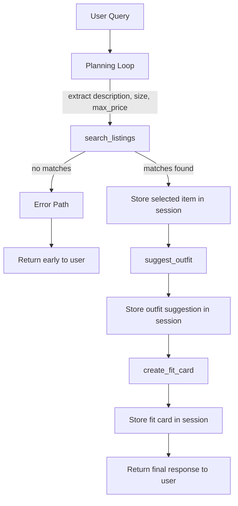

# FitFindr

FitFindr is a multi-tool AI agent that helps users discover secondhand clothing items, generate outfit recommendations, and create shareable fit cards. Users can describe the type of clothing they are looking for, along with size and budget preferences, and the agent searches a thrift listings dataset to find the best match. It then combines the selected item with pieces from the user's wardrobe to create a coordinated outfit and generates a fit card with styling details and a social-media-style caption.

The system demonstrates multi-tool orchestration, planning-loop-based decision making, state management across tool calls, and graceful error handling within an end-to-end AI agent workflow.


## Architecture Overview

The agent has three layers: a natural-language interface (Gradio), a planning loop that decides what to do next, and three tools that do the actual work.

When a query comes in, the planning loop parses it into structured parameters, calls `search_listings` against a local JSON dataset, selects the top result, passes it to `suggest_outfit` which calls the Groq LLM, then passes both the item and the outfit suggestion to `create_fit_card` for another LLM call. All intermediate state is stored in a single session dict that lives for the duration of one query. If any step produces nothing useful, the loop stops early rather than passing bad data to the next tool.



## Repository Structure

```
fitfindr/
├── data/
│   ├── listings.json          # 40 mock secondhand listings (the search dataset)
│   ├── listing-sample.json    # 2-item reference subset showing the schema
│   └── wardrobe_schema.json   # Wardrobe format definition + 10-item example wardrobe
├── tests/
│   └── test_tools.py          # Pytest suite covering all 3 tools; Groq is mocked
├── utils/
│   └── data_loader.py         # load_listings(), get_example_wardrobe(), get_empty_wardrobe()
├── agent.py                   # run_agent() planning loop and session state management
├── app.py                     # Gradio UI; handle_query() maps session dict to output panels
├── planning.md                # Design spec: tool contracts, loop logic, error table
├── requirements.txt           # Python dependencies
└── tools.py                   # The 3 tools: search_listings, suggest_outfit, create_fit_card
```

## Technologies Used

| Technology | Role |
|---|---|
| **Python 3.11** | Primary implementation language |
| **Groq SDK** (`groq==0.15.0`) | Client for calling the hosted LLM API; used in `suggest_outfit` and `create_fit_card` |
| **llama-3.3-70b-versatile** | The LLM model served via Groq; generates outfit suggestions and fit card captions |
| **Gradio** (`gradio>=6.9.0`) | Web UI framework; renders the query input, wardrobe selector, and three output panels |
| **python-dotenv** (`python-dotenv==1.0.1`) | Loads `GROQ_API_KEY` from `.env` at startup |
| **pytest** (`pytest>=8.0.0`) | Test runner for the 13-test suite in `tests/test_tools.py` |
| **unittest.mock** | Standard library; patches `tools._get_groq_client` so tests run without real API calls |
| **JSON** | Data storage format for `listings.json` and `wardrobe_schema.json` |

---

## Setup

```bash
pip install -r requirements.txt
```

Add your Groq API key to a `.env` file in the project root:

```
GROQ_API_KEY=your_key_here
```

Start the Gradio UI:

```bash
python app.py
```

Test the agent directly from the terminal:

```bash
python agent.py
```

Run the test suite (no API calls — Groq is mocked):

```bash
pytest tests/test_tools.py -v
```

---

## Tool Inventory

### `search_listings(description, size, max_price)`

**Purpose:** Find listings in the dataset that match what the user is looking for.

**Inputs:**

| Parameter | Type | Notes |
|---|---|---|
| `description` | `str` | Free-text description of the item, e.g. `"vintage graphic tee"` |
| `size` | `str \| None` | Size to filter by. Case-insensitive substring match: `"M"` matches `"S/M"` and `"M/L"`. Pass `None` to skip. |
| `max_price` | `float \| None` | Price ceiling (inclusive). Pass `None` to skip. |

**Returns:** `list[dict]`, sorted by relevance, best match first. Each dict has eleven fields: `id`, `title`, `description`, `category`, `style_tags` (list), `size`, `condition`, `price` (float), `colors` (list), `brand`, `platform`. Returns `[]` if nothing matches — does not raise.

**How it scores:** Filters by price and size first, then counts how many tokens from `description` appear anywhere in each listing's `title`, `description`, `category`, `style_tags`, `colors`, and `brand`. Listings with a score of zero are dropped. No LLM involved.

**If it fails:** Returns an empty list. The agent detects this, sets `session["error"]` to a message telling the user to loosen their filters, and stops. `suggest_outfit` and `create_fit_card` are never called.

---

### `suggest_outfit(new_item, wardrobe)`

**Purpose:** Take the selected listing and produce 1–2 outfit ideas, either using the user's wardrobe or giving general styling advice if no wardrobe is available.

**Inputs:**

| Parameter | Type | Notes |
|---|---|---|
| `new_item` | `dict` | A listing dict returned by `search_listings` |
| `wardrobe` | `dict` | Dict with an `"items"` key. May be empty or missing that key entirely. |

**Returns:** A non-empty `str`. If the wardrobe has items, the response names specific pieces by name and describes how to combine them. If the wardrobe is empty (or `"items"` is missing), the response gives general styling advice for the item instead — still useful, just not personalized.

Uses `llama-3.3-70b-versatile` at temperature 0.7, max 300 tokens.

**If it fails:** A Groq API exception is caught and the function returns a fallback string: `"Style tip for {title}: pair it with basics in complementary colors and let the piece be the focal point of your outfit."` The agent continues to `create_fit_card` with this string rather than stopping.

---

### `create_fit_card(outfit, new_item)`

**Purpose:** Turn the outfit suggestion into a 2–4 sentence social-media caption that mentions the item, price, and platform.

**Inputs:**

| Parameter | Type | Notes |
|---|---|---|
| `outfit` | `str` | The outfit suggestion from `suggest_outfit`. Dict input is also accepted and cast to string. |
| `new_item` | `dict` | The selected listing dict |

**Returns:** A `str` caption written in a casual first-person voice — the kind of thing someone would actually post as an OOTD. Uses `llama-3.3-70b-versatile` at temperature 1.2 (higher than `suggest_outfit` to get varied wording across runs), max 150 tokens.

**If it fails:** Two cases:

1. `outfit` is empty or whitespace — returns `"No outfit suggestion available — can't generate a fit card without styling details."` without making any API call.
2. Groq API exception — returns `"Couldn't generate a fit card right now: {exception}"`. Either way, no exception propagates to the agent.

---

## Planning Loop

`run_agent(query, wardrobe)` in `agent.py` orchestrates the three tools. It does not call all three unconditionally — it checks the result of each step before deciding to continue.

**Step 1 — Parse**

`_parse_query(query)` runs three regex patterns against the user's raw input:
- Price: matches `"under $30"`, `"under 30"`, or `"$30"`
- Size: matches `"size M"`, `"in size XS"`, or a bare `"in M"`
- Description: whatever remains after stripping price and size tokens

The cleaned description is what gets passed to `search_listings`. The full query string is kept in `session["query"]` as the original.

**Step 2 — Search and gate**

Calls `search_listings(description, size, max_price)`. This is the gate for the rest of the loop. If the result is an empty list:

```python
session["error"] = "No matching listings found. Try broadening your search — ..."
return session   # stops here
```

`suggest_outfit` and `create_fit_card` are never reached. `session["fit_card"]` and `session["outfit_suggestion"]` stay `None`.

**Step 3 — Select and outfit**

If results came back, `session["selected_item"]` is set to `results[0]` — the highest-scoring match. That exact dict is passed to `suggest_outfit` along with the wardrobe. The result goes into `session["outfit_suggestion"]`.

**Step 4 — Fit card**

`session["outfit_suggestion"]` and `session["selected_item"]` are passed to `create_fit_card`. The result goes into `session["fit_card"]`.

**Step 5 — Return**

The completed session dict is returned. The Gradio handler checks `session["error"]` first; if it's `None`, all three output fields are populated.

---

## State Management

Every piece of data for one interaction lives in a single session dict:

```python
{
    "query":             str,        # raw user input, never modified
    "parsed":            dict,       # {"description": ..., "size": ..., "max_price": ...}
    "search_results":    list[dict], # full result list from search_listings
    "selected_item":     dict|None,  # search_results[0], same object reference
    "wardrobe":          dict,       # passed in at the start, never mutated
    "outfit_suggestion": str|None,   # output of suggest_outfit
    "fit_card":          str|None,   # output of create_fit_card
    "error":             str|None,   # set on early exit, None on success
}
```

**How the item flows from search to outfit:** `session["selected_item"]` is set to `session["search_results"][0]` — the same dict object, not a copy. That reference is passed directly into `suggest_outfit(new_item=session["selected_item"], ...)`. The user never re-enters it.

**How the outfit flows to the fit card:** Whatever string `suggest_outfit` returns is stored as `session["outfit_suggestion"]` and immediately passed to `create_fit_card(outfit=session["outfit_suggestion"], ...)`. The agent does not reformat or summarize it — the same string appears in both the "Outfit idea" panel and inside the fit card prompt.

**On the error path:** `selected_item`, `outfit_suggestion`, and `fit_card` all stay `None`. The Gradio handler maps `None` → `""` for the output panels, so the UI shows a blank rather than the word "None".

---

## End-to-End Demo

**Query:** `"looking for a vintage graphic tee under $30"`

**Parse:** `_parse_query` extracts `description="looking for a vintage graphic tee"`, `max_price=30.0`, `size=None`. Price and size tokens are stripped from the description before it's passed to the search tool.

**Tool 1 — search_listings:**

```python
search_listings(
    description="looking for a vintage graphic tee",
    size=None,
    max_price=30.0,
)
```

The tool filters the 40-item dataset to listings priced ≤ $30, then scores each one by counting how many of the query tokens (`{"looking", "for", "a", "vintage", "graphic", "tee"}`) appear in that listing's title, description, tags, and colors. The top-scoring result is a Y2K Baby Tee priced at $18 on depop — it matches on `vintage` and `tee` in its style tags and title. The agent stores it:

```python
session["selected_item"] = {
    "title": "Y2K Baby Tee — Butterfly Print",
    "price": 18.0,
    "platform": "depop",
    "condition": "excellent",
    "size": "S/M",
    "colors": ["white", "pink", "purple"],
    "style_tags": ["y2k", "vintage", "graphic tee", "cottagecore"],
    ...
}
```

**Tool 2 — suggest_outfit:**

```python
suggest_outfit(
    new_item=session["selected_item"],
    wardrobe=session["wardrobe"],    # example wardrobe with 10 items
)
```

The wardrobe has items, so the tool builds a prompt listing each wardrobe piece by name, category, and color and asks the LLM to name specific combinations. A real response from the live model:

> *"Pair the Y2K Baby Tee with the Baggy straight-leg jeans and Chunky white sneakers for a casual, laid-back look. The dark blue jeans will ground the playful, vintage vibe of the tee. Or, layer it under the Vintage black denim jacket with the Wide-leg khaki trousers and Black combat boots for an edgier contrast."*

Stored as `session["outfit_suggestion"]`.

**Tool 3 — create_fit_card:**

```python
create_fit_card(
    outfit=session["outfit_suggestion"],
    new_item=session["selected_item"],
)
```

The prompt gives the LLM the item's title, price ($18.0), platform (depop), colors, and style tags alongside the outfit text. A real response:

> *"I just scored the cutest Y2K Baby Tee — Butterfly Print on depop for $18 and it goes with everything I already own. Paired it with my baggy dark-wash jeans and chunky white sneakers and the butterfly print does exactly what it's supposed to — makes the whole fit feel intentional without trying."*

Stored as `session["fit_card"]`. The Gradio UI renders all three output panels from the session.

---

## Error Handling

### search_listings — no results

If the dataset has no listings matching the query's description, size, and price constraints, `search_listings` returns `[]`. The agent immediately sets:

```python
session["error"] = (
    "No matching listings found. Try broadening your search — "
    "remove the size filter, raise the price limit, or use different keywords."
)
return session
```

Neither `suggest_outfit` nor `create_fit_card` is called. `session["fit_card"]` stays `None`.

**Concrete example from the test suite** (`test_no_results_returns_empty_list`):

```python
result = search_listings("ballgown", size="XXS", max_price=5.0)
assert result == []
```

The dataset has no ballgowns, no items priced under $5, and nothing in XXS — the intersection is empty. Running the full agent with this query sets `session["error"]` and leaves `session["outfit_suggestion"]` and `session["fit_card"]` as `None`, verified by patching `suggest_outfit` and asserting `call_count == 0`.

---

### suggest_outfit — empty wardrobe

When `wardrobe["items"]` is empty (or the `"items"` key doesn't exist), the tool switches to a different prompt rather than failing. Instead of asking the LLM to combine the new item with specific wardrobe pieces, it asks for general styling advice: what types of pieces pair well, what vibe the item suits.

The function still returns a non-empty string — it never crashes or returns `""` just because the wardrobe is empty. This is tested in `test_empty_wardrobe_returns_nonempty_string` and `test_missing_items_key_does_not_raise`.

If the Groq API call itself fails, the exception is caught and the tool returns: `"Style tip for {title}: pair it with basics in complementary colors and let the piece be the focal point of your outfit."` The agent uses this string as the `outfit_suggestion` and proceeds to `create_fit_card`.

---

### create_fit_card — empty outfit

If `outfit` is an empty string or whitespace-only, the function returns before touching the API:

```python
return "No outfit suggestion available — can't generate a fit card without styling details."
```

This is tested in `test_empty_outfit_returns_error_string` and `test_whitespace_outfit_returns_error_string`. The agent stores this string as `session["fit_card"]` and returns normally — the listing and outfit panels still display, only the fit card panel shows the error message.

If the API call fails for any other reason, the exception is caught and the function returns `"Couldn't generate a fit card right now: {exception}"`.

---

## Spec Reflection

**Where the spec helped most**

The error handling table in `planning.md` maps directly to control flow decisions in `run_agent`. Having the three failure modes written down as `(tool, failure mode, agent response)` rows made it straightforward to write the early-exit branch after `search_listings`, the empty-wardrobe prompt switch in `suggest_outfit`, and the pre-guard in `create_fit_card`. Without that table, those cases would have been easier to miss.

**One divergence and why**

The spec left query parsing open: "you can use regex, string splitting, or ask the LLM." An LLM parse would handle unusual phrasings like "no more than forty bucks" or "anything under a fifty" correctly. Regex was chosen instead for two reasons: it adds no latency and costs no tokens, and the demo query patterns are predictable enough that the regex handles them reliably. The tradeoff is brittleness for edge-case phrasings — acceptable for a demo, a liability in production.

---

## AI Usage Transparency

### 1. Implementing search_listings and the test suite

**What was given to the AI:** The Tool 1 spec section from `planning.md` (inputs, return format, scoring logic in the TODO comments), the listing schema from `data/listing-sample.json`, and the existing stub in `tools.py`.

**What was asked:** Implement the function body, replacing the `return []` stub with filtering and keyword-scoring logic.

**What the AI produced:** The token-intersection scoring loop — load all listings, filter by price and size, build a set of tokens per listing from five fields, count overlap with query keywords, sort by score. Structurally correct.

**What was revised:** The initial test suite had two wrong query/filter combinations discovered only after running pytest. `test_price_filter_respected` used `"jacket"` under `$30.00` — no jackets in the dataset fall under that price, so the result was `[]` and `assert result` failed. Corrected to `"vintage"` under `$25.00`. `test_size_filter_respected` used `"jeans"` with `size="M"` — jeans in the dataset use waist/length notation (`"W30 L30"`), not standard sizes, so `"m"` never appears in those size strings. Corrected to `"top"` with `size="M"`, which matches items sized `"S/M"` and `"M/L"`.

---

### 2. Implementing create_fit_card

**What was given to the AI:** The Tool 3 spec section from `planning.md` (the caption style requirements, the note about using higher temperature, the empty-outfit guard), and the already-implemented `suggest_outfit` as a reference for the Groq call pattern.

**What was asked:** Implement `create_fit_card` following the same Groq call structure as `suggest_outfit`, with the guard and caption prompt.

**What the AI produced:** The empty-string guard, the prompt with item title/price/platform/colors/style-tags plus outfit text, the Groq call returning `response.choices[0].message.content.strip()`, and exception handling returning a fallback string.

**What was revised:** The initial temperature was 0.7 — same as `suggest_outfit`. Running the function three times on the same input produced captions that were nearly word-for-word identical. Raised temperature to 1.2, re-ran, and confirmed all three outputs differed in wording and sentence structure before keeping the change. The rest of the implementation was adopted unchanged.
