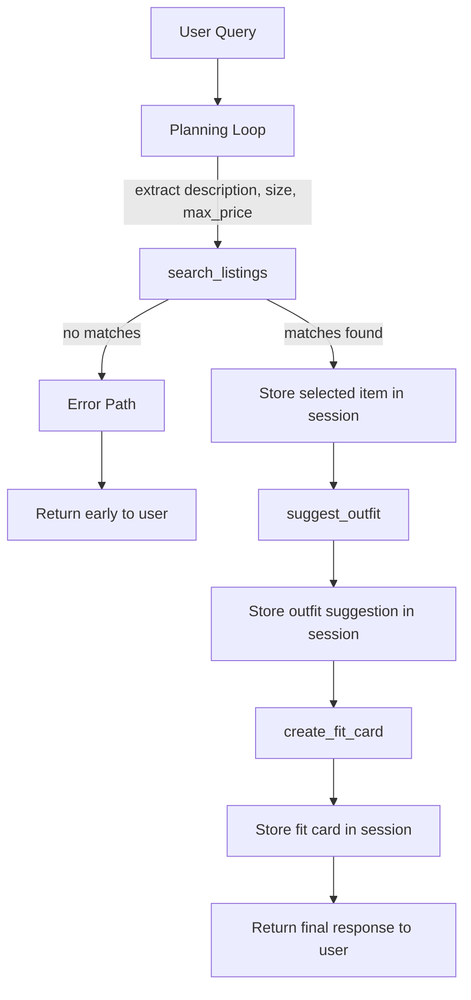

# FitFindr — planning.md

> Complete this document before writing any implementation code.
> Your spec and agent diagram are what you'll use to direct AI tools (Claude, Copilot, etc.) to generate your implementation — the more specific they are, the more useful the generated code will be.
> Your planning.md will be reviewed as part of your submission.
> Update it before starting any stretch features.

---

## Tools

### Tool 1: search_listings

**What it does:**
Searches the listings dataset for secondhand items that match the user’s request. It filters by the item description, optional size, and maximum price, then returns the best matches sorted by relevance.

**Input parameters:**
- `description` (str): A short natural-language description of the item the user wants, such as "vintage graphic tee" or "black midi skirt".
- `size` (str): The requested size, such as `XS`, `S`, `M`, `L` or any non-standard size or `None` if size is not specified.
- `max_price` (float): The highest price the user is willing to pay.

**What it returns:**
A list of matching listing objects. Each result includes fields such as:
- `id`
- `title`
- `description`
- `category`
- `style_tags`
- `size`
- `condition`
- `price`
- `colors`
- `brand`
- `platform`

The list should be ordered from most relevant to least relevant, and the agent should use the top result as the main item when a match exists.

**What happens if it fails or returns nothing:**
If no listings match, the agent tells the user that nothing was found and suggests loosening the search, such as increasing the budget or removing the size filter. 

---

### Tool 2: suggest_outfit

**What it does:**
Takes the selected listing from `search_listings` and combines it with the user’s wardrobe to suggest one or more complete outfit ideas. It helps the user understand how to wear the new thrifted item with pieces they already own.

**Input parameters:**
- `new_item` (dict): The chosen listing from `search_listings`, including the item’s title, category, style tags, size, condition, price, and other metadata.
- `wardrobe` (dict): The user’s current wardrobe data, including clothing items already owned and their relevant attributes.

**What it returns:**
A styling recommendation or list of outfit suggestions. The output should describe how to combine the new item with wardrobe pieces, and may include notes about layering, fit, color matching, or styling details. If multiple outfit options are possible, the tool can return more than one suggestion.

**What happens if it fails or returns nothing:**
If the wardrobe is empty or too limited, the agent should still provide a fallback styling suggestion based on the new item alone, rather than crashing. If no useful outfit can be generated, the agent tells the user that more wardrobe details are needed and gives a simple generic styling tip.

---

### Tool 3: create_fit_card

**What it does:**
Generates a short, shareable outfit description that sounds like a social media caption or fit check post. It turns the outfit suggestion into a polished, personality-driven line the user can reuse or share.

**Input parameters:**
- `outfit` (str or dict): The outfit suggestion produced by `suggest_outfit`, including the styling idea and key wardrobe pieces.
- `new_item` (dict): The thrifted item found by `search_listings`, used so the fit card can reference the item naturally and accurately.

**What it returns:**
A short caption-style text string describing the full outfit in a casual, shareable tone. The output should feel specific to the item and outfit, not generic or repeated.

**What happens if it fails or returns nothing:**
If the outfit data is incomplete, the agent should skip the fit card and show the outfit suggestion instead. If the tool fails entirely, the agent should still return the listing summary and outfit advice so the user does not lose the main result.

---

## Planning Loop

**How does your agent decide which tool to call next?**

The agent uses a simple conditional loop that checks the current session state after each tool call.

1. **Start with the user request.**  
   The agent first extracts the item description, size, price limit, and any wardrobe information from the user message. It stores these values in session state so they can be reused later.

2. **Call `search_listings` first.**  
   The agent always begins by calling `search_listings(description, size, max_price)` because it needs a candidate item before it can do anything else.

3. **Check whether search results are empty.**  
   After `search_listings` returns:
   - If `results` is empty, the agent sets `session.error_message` to something like “No matching listings found,” sends a helpful message to the user, and stops.
   - If `results` contains one or more listings, the agent sets `session.selected_item = results[0]` and continues.

4. **Call `suggest_outfit` only if a valid item was found.**  
   The agent passes `session.selected_item` and the user’s wardrobe into `suggest_outfit(new_item, wardrobe)`.

5. **Check whether outfit suggestions were produced.**  
   After `suggest_outfit` returns:
   - If the wardrobe is empty or the tool cannot build a useful outfit, the agent sets `session.outfit_fallback = true` and returns a simpler styling message based on the new item alone.
   - If the tool returns a valid outfit suggestion, the agent stores it in `session.outfit`.

6. **Call `create_fit_card` only when outfit data exists.**  
   The agent calls `create_fit_card(outfit, new_item)` using the outfit suggestion and the selected listing.

7. **Check whether the fit card was created successfully.**  
   After `create_fit_card` returns:
   - If it succeeds, the agent stores the caption in `session.fit_card` and includes it in the final response.
   - If it fails or returns nothing, the agent skips the fit card and still returns the listing summary plus the outfit suggestion.

8. **Stop when the workflow is complete.**  
   The loop ends once the agent has either:
   - returned an error or no-results message after `search_listings`, or
   - produced the selected item, outfit suggestion, and optional fit card for the final response.

This means the agent does not call every tool automatically every time. It only moves to the next step when the previous step produced usable data.

---

## State Management

**How does information from one tool get passed to the next?**

The agent keeps a session state object during the interaction. After the user’s message is parsed, the agent stores the search terms, any size or price constraints, and any wardrobe information in state so they can be reused across tool calls. When `search_listings` returns results, the agent saves the chosen item as `selected_item` in session state and passes that exact object into `suggest_outfit` without asking the user to repeat it. If `suggest_outfit` returns a usable outfit, the agent stores it as `outfit_suggestion` and then passes both `selected_item` and `outfit_suggestion` into `create_fit_card`. If any step fails, the agent updates the same session state with an error or fallback flag so it knows whether to stop early or continue with a simpler response.

---

## Error Handling

For each tool, describe the specific failure mode you're handling and what the agent does in response.

| Tool | Failure mode | Agent response |
|------|-------------|----------------|
| search_listings | No results match the query | The agent tells the user that nothing matched, suggests broadening the search by changing the description, size, or price limit, and stops instead of calling later tools with empty input. |
| suggest_outfit | Wardrobe is empty | The agent returns a fallback styling suggestion based on the new item alone, or asks the user to provide more wardrobe details if needed. It does not crash or try to invent wardrobe pieces. |
| create_fit_card | Outfit input is missing or incomplete | The agent skips the fit card step and returns the item summary plus the outfit suggestion it already has. If needed, it asks for a clearer outfit description before trying again. |

---

## Architecture

---

## AI Tool Plan

I will use **Claude Code** to help implement the agent, because it is useful for turning a written spec into working code while keeping the structure of the project intact.

### Milestone 1: Build `search_listings`
I will give Claude Code the **Tool 1: search_listings** section from `planning.md`, including the input parameters, return value, and failure behavior. I will also give it the relevant data loader details so it uses the provided listings data instead of inventing its own format. I expect it to produce a function that filters by `description`, `size`, and `max_price`, returns a ranked list of matching listings, and handles the no-results case cleanly. Before using it, I will verify that the code checks all three filters, returns the correct fields for each listing, and produces a clear empty-result response when nothing matches. I will test it with at least three queries: one normal match, one size mismatch, and one no-results case.

### Milestone 2: Build `suggest_outfit`
I will give Claude Code the **Tool 2: suggest_outfit** section from `planning.md`, plus the wardrobe schema and the agent diagram so it understands how the selected item flows into the next step. I expect it to generate a function that combines the new item with wardrobe items and returns one or more outfit suggestions. Before using it, I will check that it accepts the required inputs, works with a full wardrobe, and still returns a fallback suggestion when the wardrobe is empty or too small. I will test it with both `get_example_wardrobe()` and `get_empty_wardrobe()`.

### Milestone 3: Build `create_fit_card`
I will give Claude Code the **Tool 3: create_fit_card** section from `planning.md`, including the expected input types, return format, and failure handling. I expect it to produce a function that turns the outfit suggestion into a short shareable caption with a different output for different inputs. Before trusting it, I will verify that it uses both the outfit and selected item, produces a brief social-style line, and does not repeat the same wording for different outfits. I will test it with at least two different outfit inputs.

### Milestone 4: Implement the planning loop and state management
I will give Claude Code the **Planning Loop** section and the **Architecture** diagram from `planning.md`. I expect it to implement conditional control flow that stores the selected listing in session state, passes it into `suggest_outfit`, and only calls `create_fit_card` after a valid outfit exists. Before using it, I will verify that the code stops early when `search_listings` returns no results, preserves state across tool calls, and does not run tools in a fixed sequence regardless of the output. I will test the full multi-step flow from user query to final fit card.

### Milestone 5: Verify error handling and final demo behavior
I will use Claude Code to help review the full implementation against the **error handling** parts of `planning.md`, especially the no-results path and the empty-wardrobe fallback. I expect it to help me spot missing branches or inconsistent return values. Before finalizing, I will verify that each tool fails gracefully, the agent returns useful user-facing messages, and the demo flow matches the step-by-step example in `planning.md`. I will run end-to-end tests for success, partial failure, and no-match cases.

### Final check
After each milestone, I will compare the code output against the exact tool specs in `planning.md` and the architecture diagram. I will not move to the next milestone until the current one behaves exactly as described in the plan.

**Milestone 3 — Individual tool implementations:**

**Milestone 4 — Planning loop and state management:**

---

## A Complete Interaction (Step by Step)

Write out what a full user interaction looks like from start to finish — tool call by tool call. Use a specific example query.

**Example user query:** "I'm looking for a vintage graphic tee under $30. I mostly wear baggy jeans and chunky sneakers. What's out there and how would I style it?"

**Step 1: Search for matching listings**

The agent extracts the search criteria from the user's request:

- Description: "vintage graphic tee"
- Maximum price: $30
- Size: not specified

The agent calls:

search_listings(
    description="vintage graphic tee",
    size=None,
    max_price=30.0
)

The tool searches the listings dataset and returns matching items sorted by relevance. The agent selects the highest-ranked result.

Example result:

{
  "title": "Faded Band Tee",
  "price": 22,
  "platform": "Depop",
  "condition": "Good",
  "size": "M"
}

If no listings are found, the agent informs the user and suggests adjusting the search criteria.

**Step 2: Generate an outfit suggestion**

The selected listing from Step 1 is stored in the agent's state and passed to the outfit tool along with the user's wardrobe information.

The agent calls:

suggest_outfit(
    new_item=<Faded Band Tee>,
    wardrobe=<user wardrobe>
)

The tool analyzes the new item and wardrobe pieces to generate styling recommendations.

Example result:

"Pair the faded band tee with your baggy jeans and chunky sneakers for a relaxed 90s-inspired look. Add a flannel overshirt for layering."

If the wardrobe is empty or has too few items, the tool provides a generic styling suggestion instead of failing and non availability in the wardrobe is implied in the result.

**Step 3: Create a shareable fit card**

The outfit recommendation and selected listing are passed to the final tool.

The agent calls:

create_fit_card(
    outfit=<outfit suggestion>,
    new_item=<Faded Band Tee>
)

The tool generates a short social-media-style caption describing the complete outfit.

Example result:

"Found this faded band tee for $22 on Depop and it fits perfectly with my baggy jeans and chunky sneakers 🔥 thrift finds never miss."

If the tool encounters an issue, the agent returns the outfit recommendation without the fit card rather than ending the workflow.

**Final output to user:**

Top Match:
- Faded Band Tee
- $22
- Depop
- Good condition

Outfit Suggestion:
Pair the faded band tee with your baggy jeans and chunky sneakers for a relaxed 90s-inspired look. Add a flannel overshirt for layering.

Fit Card:
"Found this faded band tee for $22 on Depop and it fits perfectly with my baggy jeans and chunky sneakers 🔥 thrift finds never miss."